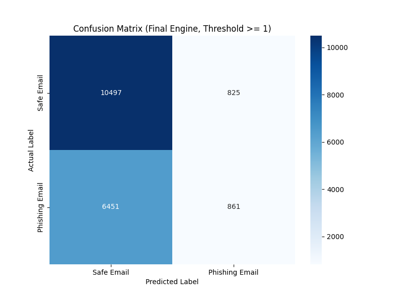

# Email Phishing Detection Using Rule-Based Methods

A rule-based engine for detecting phishing emails, developed as part of an MSc Cybersecurity dissertation. The system scores each email against five heuristic indicators commonly associated with phishing and evaluates performance against a labelled dataset of ~18,600 emails.

## Why This Matters

Phishing remains one of the most common initial access vectors in cyberattacks, and email is still the primary delivery channel. While many modern spam filters rely on machine learning, rule-based detection remains valuable: it is transparent, interpretable, and doesn't require training data or a black-box model to explain a decision to an analyst. This project explores how far a small set of explicit, human-readable rules can go on their own, and — just as importantly — where they fall short.

## The Five Detection Rules

Each email is checked against five independent heuristics. Every rule that fires adds one point to the email's phishing score.

| # | Rule | What it checks |
|---|------|-----------------|
| 1 | **Urgency indicators** | Presence of pressure/urgency language (e.g. "urgent", "action required", "account restricted", "security alert") |
| 2 | **IP address in links** | Whether any link in the email uses a raw numeric IP address instead of a domain name |
| 3 | **Link text / URL mismatch** | Whether a hyperlink's visible text looks like a domain name that doesn't match its actual `href` destination |
| 4 | **Generic salutation** | Greetings like "Dear Customer", "Dear User", "Dear Valued Member" instead of a personal name |
| 5 | **Sender / link domain mismatch** | Whether any link in the email points to a domain different from the sender's domain (extracted from the `From:` header) |

## How Scoring Works

`analyze_email()` runs all five rule functions against the email text and sums the number that trigger, producing a **phishing score from 0 to 5**. An email is classified as phishing if its score meets or exceeds a configurable threshold (`SCORE_THRESHOLD`, set to **1** in the current evaluation — i.e. a single triggered rule is enough to flag an email).

## Dataset

The evaluation uses a labelled email dataset (`Phishing_Email.csv`, ~18,650 rows with `Email Text` and `Email Type` columns) matching the well-known Kaggle **"Phishing Email Detection"** dataset. It is **not included in this repository**:

- It's a third-party dataset and I haven't independently re-verified its exact redistribution terms.
- At 18k+ raw emails, it's large and not something this repo needs to ship.

To reproduce the results: download a "Phishing Email Detection" dataset with `Email Text` / `Email Type` columns from Kaggle (search that exact name), place it in the project root as `Phishing_Email.csv`, and run `main.py`.

## Evaluation Methodology

`main.py` loads the dataset, drops rows with missing email text, runs every email through the five-rule engine, and compares the predicted label against the ground-truth label using `scikit-learn`. It reports accuracy, precision, and recall, and saves a confusion matrix heatmap (`confusion_matrix_final.png`).

## Results

Evaluated on 18,634 emails (after removing rows with missing text), at a classification threshold of score ≥ 1:

| Metric | Score |
|---|---|
| Accuracy | 60.95% |
| Precision (Phishing) | 51.07% |
| Recall (Phishing) | 11.78% |

**Confusion matrix:**

|  | Predicted Safe | Predicted Phishing |
|---|---|---|
| **Actual Safe** | 10,497 | 825 |
| **Actual Phishing** | 6,451 | 861 |

## Limitations

- **Low recall.** The engine misses the large majority of phishing emails in this dataset. Three of the five rules (IP-in-link, link/URL mismatch, sender/link domain mismatch) depend on the email containing hyperlinks and a parseable `From:` header — many emails in this corpus are plain text with neither, so those rules simply can't fire on them. This is a realistic limitation of purely rule-based, header/link-dependent heuristics against a diverse, mixed-format dataset rather than a curated set of "typical" HTML phishing emails.
- **Simple heuristics.** Rules rely on keyword lists and regex patterns, which are easy to bypass with paraphrasing, obfuscation, or minor formatting changes — a known weakness of static rule-based systems compared to ML-based text classifiers.
- **No feature interaction / weighting.** Every triggered rule counts equally toward the score; the engine doesn't weigh, for example, a domain mismatch more heavily than a generic salutation.
- **Threshold sensitivity.** Results depend heavily on `SCORE_THRESHOLD`; this evaluation uses a threshold of 1, which favours recall of *some* signal over precision, but recall is still low overall because most emails trigger zero rules.

## Future Improvements

- Add more rules (e.g. attachment-type checks, SPF/DKIM/DMARC validation, homoglyph/lookalike domain detection).
- Introduce weighted scoring instead of equal-weight rule counting.
- Compare against an ML baseline (e.g. TF-IDF + logistic regression / random forest) to quantify the rule-based vs. learned-model trade-off.
- Tune `SCORE_THRESHOLD` systematically and report a precision/recall curve instead of a single operating point.

## Technologies Used

- Python 3
- pandas
- BeautifulSoup4 (HTML/link parsing)
- scikit-learn (metrics)
- seaborn / matplotlib (confusion matrix visualisation)

## How to Run

\`\`\`bash
# 1. Clone the repo
git clone https://github.com/stannou/email-phishing-detection.git
cd email-phishing-detection

# 2. Create a virtual environment (optional but recommended)
python3 -m venv .venv
source .venv/bin/activate   # Windows: .venv\Scripts\activate

# 3. Install dependencies
pip install -r requirements.txt

# 4. Add the dataset
# Download a "Phishing Email Detection" dataset (Email Text / Email Type columns)
# from Kaggle and save it as Phishing_Email.csv in this folder.

# 5. Run the evaluation
python main.py
\`\`\`

## Author

Manish Hajur Khadka — MSc Cybersecurity dissertation project.
